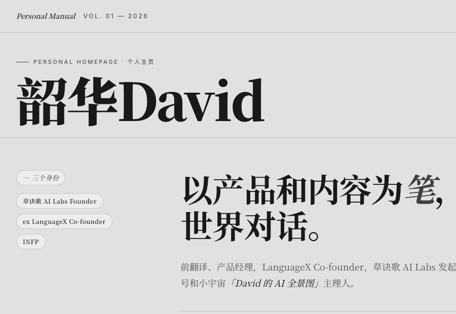

# 司马迁.skill

> 人人都有自己的司马迁。

`司马迁.skill` 是一个帮你写下“我是谁”的开源 Agent Skill。

它是 Personal OS 系列的第一卷：先写下“你是谁”，再把“你怎么工作”交接给 AI。

它有三个入口：

- **轻列传**：30 秒，生成一张《某某列传》卡片，下载成 1080x1080 图片，适合发朋友圈、小红书，或给自己看一眼“AI 眼里的我”。
- **精列传**：15 分钟，把你的文章、简历、播客、社媒、笔记和可选访谈，整理成一套完整的个人使用说明书。
- **FDE 入场包**：轻量即刻 / 证据版 60 分钟。默认只用本轮明确提供的材料和 `persona-agent.md`；证据版由用户主动准备材料目录，先做材料地图，再确认分析，把高频工作流写成 AI 可执行的交接包，附一份使用分析报告。


轻列传是一张图。

精列传是一套个人使用说明书。

FDE 入场包是一套 AI 交接资产：让强模型帮你把工作现场整理成流程、模板和判断边界，交给日常使用的 AI 接管重复任务。

背后的方法，全部开源在这里。

## 宣言

司马迁来不及做的，是给还活着的年轻人立传。

AI 时代，如果记录一个人的资源不再稀缺，我们想尝试一次：在一个人最宝贵的年岁里，帮他知道自己是谁。

这份被认真记录的资格，也应该留给正在寻找自己作品、还有时间的人。完整文字见 [`MANIFESTO.md`](./MANIFESTO.md)。

## 立即体验

打开：<https://simaqian.caojuege.com>

你可以直接选择：

| 模式 | 适合谁 | 输出 |
| --- | --- | --- |
| 轻列传 | 想先玩一下、发一张图、看看 AI 如何理解自己 | 一张《某某列传》卡片 |
| 精列传 | 想认真整理自己，让 AI 和合作方更懂你 | `persona-agent.md` + `personal-homepage.html` |
| FDE 入场包 | 想让 AI（哪怕更便宜的模型）接管日常工作 | `fde-pack/` 编号交接包 + 使用分析报告 |

## 精列传会生成什么

1. `persona-agent.md`

   给 AI agent 用，帮助它理解你的事实、判断、风格、边界和协作方式。

2. `personal-homepage.html`

   给人看，帮助合作方快速知道你是谁、能提供什么、正在寻找什么合作。

3. `exports/personal-homepage.pdf`

   按主页模板的屏幕视觉导出的 PDF 版本，适合发邮件、打印、飞书/微信转发。

4. `exports/personal-homepage-long.png`

   长图版本，适合手机查看、朋友圈、小红书或群聊直接预览。

它不是人格测试，不是心理诊断，也不是营销包装。

它只做一件事：把已经在你身上的东西，写成 AI 和人都能读懂的形态。


## 个人主页模板

精列传现在内置两套 `personal-homepage.html` 模板。默认使用**草诀歌风格**；如果用户更需要艺术感、个人照片和人文气质，可以切换到**文艺复兴风格**。

### 草诀歌风格

偏报纸、档案、正史感，适合克制、理性、作品索引型表达。



模板文件：[assets/caojuege-homepage-template.html](./assets/caojuege-homepage-template.html)  
样例文件：[examples/david-personal-homepage.public.html](./examples/david-personal-homepage.public.html)

### 文艺复兴风格

偏长卷、画廊、人文气质，适合创作者、审美驱动者和有个人作品气息的人。


模板文件：[assets/renaissance-homepage-template.html](./assets/renaissance-homepage-template.html)  
样例文件：[examples/david-personal-homepage-renaissance.public.html](./examples/david-personal-homepage-renaissance.public.html)

## 如何使用精列传

### 用 Claude Code / Codex / Antigravity / OpenClaw

把下面这段粘给你的 Agent：

```text
帮我跑 github.com/ShaohuaDavidLee/simaqian 这个 skill。
如果还没装，先 clone 到 ~/.claude/skills/simaqian.skill。
我的材料放在 ./me/ 里。如果我没材料，访谈我就行。
```

Agent 会读取仓库、执行 `SKILL.md` 里的工作流，并生成个人 OS 资产包。

### 用 ChatGPT / Claude.ai / Kimi / 豆包

把下面这段粘进聊天窗口：

```text
请按 github.com/ShaohuaDavidLee/simaqian 这个仓库的 SKILL.md
帮我跑一份个人使用说明书。读完 README、SKILL.md 和 references/
就能开始。我的材料下面给你。
```

然后继续贴你的材料：文章、简历、播客转写、社媒长帖、作品链接都可以。

没有材料也可以直接说：

```text
我没有材料，访谈我吧。
```

## 如何使用 FDE 入场包

FDE（Forward Deployed Engineer）帮企业把 AI 部署进业务现场；FDE 入场包帮你把 AI 部署进自己的工作现场。模型是租来的，资产是买下的。

推荐路径：先跑轻量版，拿到第一版可用交接包；如果你想用更多历史材料校准它，再准备 `./export/`，复制证据版第 1 步。证据版第 1 步只做材料地图，确认后才生成证据版入场包。

默认先跑轻量版。把这段粘给能执行代码的 agent（Claude Code / Codex / Cowork）：

```
请使用本地 simaqian.skill 生成 FDE 入场包的轻量版。
如果本地还没有这个 skill，请先安装公开仓库：https://github.com/ShaohuaDavidLee/simaqian

本轮只使用以下来源：
1. 我在本轮对话里明确提供的材料
2. 当前工作区已有的 persona-agent.md
3. 我明确指出的项目文件

如果材料不足，请先问我最多 5 个问题。

输出：
1. fde-pack/00_README.md
2. fde-pack/01_analysis-report.md
3. fde-pack/03_workflows.md
4. fde-pack-all.md

请给每个结论标注来源：
- 明确材料
- 我的回答
- 你的推断
```

证据版不要和轻量版放在同一条消息里。先跑轻量版；如果你愿意准备更完整的历史材料、项目记录、笔记或工作文档，再升级证据版。

证据版第 1 步只做材料地图，不生成入场包。等你主动准备好材料目录后，再复制：

```text
我已经准备好 FDE 入场包证据版材料目录：
./export/

请先只做材料地图，不生成入场包。

输出：
1. 文件清单
2. 可分析的时间范围
3. 主题分类
4. 高频工作流候选
5. 隐私风险类型
6. 你建议跳过或脱敏的内容类型

要求：
不要输出原文摘录。
不要生成 fde-pack/。
不要做结论分析。
完成材料地图后等我确认，再继续生成证据版 FDE 入场包。
```

材料地图没有问题后，在同一对话里回复：

```text
我确认继续生成证据版 FDE 入场包。

请基于刚才的材料地图和允许分析的材料，生成：
1. fde-pack/00_README.md
2. fde-pack/01_analysis-report.md
3. fde-pack/02_context.md
4. fde-pack/03_workflows.md
5. fde-pack/04_routing.md
6. fde-pack/05_skills/
7. fde-pack/06_templates/
8. fde-pack-all.md

要求：
- 不引用敏感原文
- 人名、公司名、金额等默认脱敏，除非我明确说可以公开
- 每个结论标注来源：证据 / 我的回答 / 推断
- 高频工作流要写到日常 AI 可执行
- 判断类任务要标注升级信号
```

细节见 [references/fde-pack.md](references/fde-pack.md)。

## 它怎么工作

精列传默认四步：

1. **先吸收材料**：不一上来发长问卷，先读你已经写下、说过、做过的东西。
2. **再补关键缺口**：只问少量高杠杆问题，比如“你不是谁？”“别人最容易误解你什么？”“AI 绝对不能替你说什么？”
3. **可选深度访谈**：如果你想要更像自己的版本，再做 6-10 个定制追问。
4. **输出个人 OS 资产包**：一份给 AI 用，一份给人看，并导出方便转发的 PDF 和长图。

生成网页后，可以用内置脚本按当前模板的屏幕视觉导出 PDF 和长图：

```bash
npm install
npm run export:setup
npm run export:homepage
```

默认读取当前目录的 `personal-homepage.html`，输出：

```text
exports/personal-homepage.pdf
exports/personal-homepage-long.png
```

想先看成品效果：

[examples/david-persona-agent.public.md](./examples/david-persona-agent.public.md)

## 适合什么场景

- 想做一份个人使用说明书或个人主页
- 想让 AI 更准确地理解和协助你
- 想把文章、简历、播客、笔记蒸馏成 AI persona
- 想让合作方更快知道“你是谁 / 你能提供什么 / 你在找什么”
- 想在做作品、转型、创业前，更清楚地整理自己的方向

## 隐私默认

默认采取“公开行为对齐”原则：

如果一项信息只在简历或私聊里出现，但公开文章、播客、社媒、官网从未提及，默认不写进 persona。用户明确同意后才纳入。

家庭、年龄、薪资、电话、住址、健康、未公开商业合作等敏感字段默认跳过。完整规则见 [`SKILL.md`](./SKILL.md)。

> 注意：生成的 `persona-agent.md` 和 `personal-homepage.html` 默认是你的私有文件，不要提交到公开仓库（已在 `.gitignore` 中忽略）。`examples/` 里的样例都是创作者本人同意公开、并已脱敏的版本。

## 文件结构

```text
simaqian.skill/
├── README.md
├── MANIFESTO.md
├── SKILL.md
├── VERSION
├── LICENSE
├── .gitignore
├── package.json
├── agents/
│   └── openai.yaml
├── assets/
│   ├── caojuege-homepage-template.html
│   ├── renaissance-homepage-template.html
│   ├── personal-homepage-template.html
│   └── friend-review-template.md
├── examples/
│   ├── assets/
│   ├── screenshots/
│   ├── README.md
│   ├── david-persona-agent.public.md
│   ├── david-personal-homepage.public.html
│   └── david-personal-homepage-renaissance.public.html
├── landing/
│   └── index.html
├── scripts/
│   └── export-homepage.mjs
├── tests/
│   └── export-homepage.test.mjs
└── references/
    ├── intake-and-interview.md
    ├── output-spec.md
    └── fde-pack.md
```

## 设计原则

- **低摩擦**：先吃已有材料，不默认发长问卷。
- **双入口**：轻列传用于快速体验，精列传用于认真整理。
- **双输出**：同时服务 AI 和人。
- **具体优先**：少写空泛人格词，多写事实、能力、判断和边界。
- **克制表达**：不把个人使用说明书写成成功学包装。

## 为什么开源

司马迁把列传写给帝王将相，也写给刺客、游侠、商人和滑稽艺人。

AI 时代，记录一个人的资源不再那么稀缺。也许我们可以更早一点，在一个人还在寻找、还在创造、还有时间的时候，帮他把自己写清楚。

这就是 `司马迁.skill` 想做的事。

## Made by

[草诀歌 AI Labs](https://www.caojuege.com/) — 一个帮助人用 AI 做出“作品型产品”的社区。

## 版本

当前版本：`v0.5.1`
